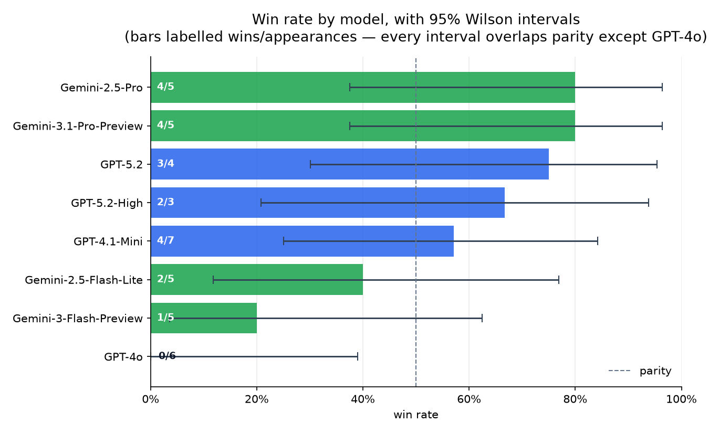
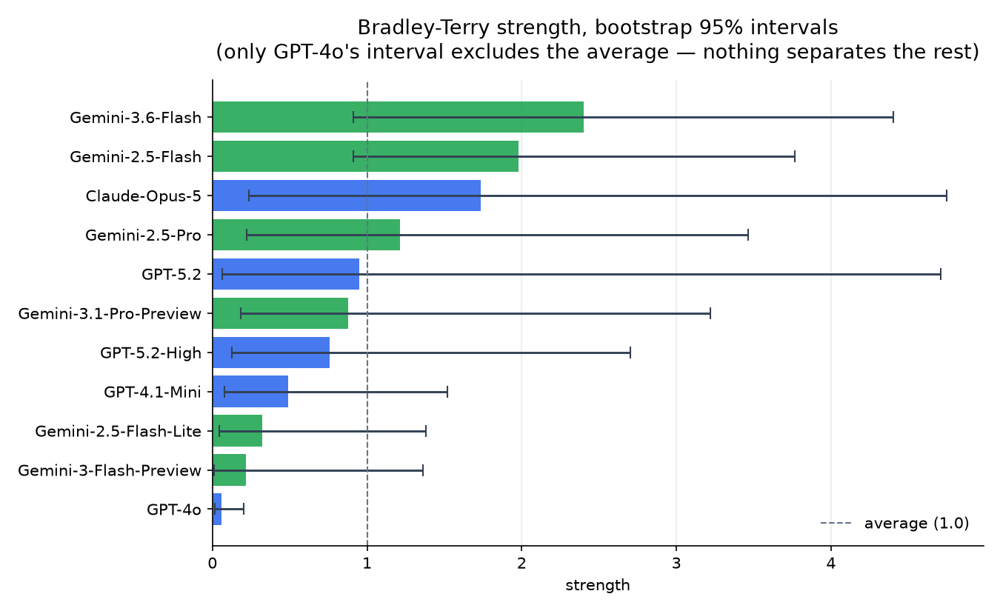

# LLM Evaluation for Cybersecurity SOC Tasks

A benchmarking project comparing different large language models on cybersecurity and SOC-oriented tasks using **Handshake AI Versus** pairwise comparisons.

**[Live dashboard →](https://nicky-quist.github.io/llm-cybersecurity-benchmark/dashboard/index.html)**

## Project Goal

This project evaluates how different LLMs perform on technical tasks that matter in SOC and security engineering workflows, including:

- MITRE ATT&CK explanation
- SOC detection guidance
- incident investigation
- detection engineering
- Python scripting
- threat intelligence concepts
- anomaly detection for cyber
- hallucination resistance
- cloud and identity security workflows
- security automation and incident communication

Rather than claiming broad model superiority, this project explores whether **different models perform better on different cybersecurity task types**.

## AI SOC Copilot — extending the benchmark into a live tool

**[copilot/](copilot/)** takes this project's evaluation muscle and applies it to a real alert instead of a static prompt: given a triaged alert (in [soc-triage-tool](https://github.com/nicky-quist/soc-triage-tool)'s output schema), it retrieves MITRE ATT&CK and live CVE/NVD context, then uses Claude to recommend a next action with an explicit explainability rationale. Runs with zero configuration — no API key required to see the full pipeline execute. See [copilot/README.md](copilot/README.md) for the design and a usage example.

## Methodology

- Platform: Handshake AI Versus (round one — **no longer reachable**; see
  [the collection harness](harness/) for what replaces it)
- Evaluation design: pairwise model comparisons
- Judging: blind to model identity in both rounds (Versus revealed the names only after
  each verdict; the round-2 harness withholds them entirely)
- Number of prompts: 20 (round 1); 28 comparisons total across two rounds
- Domains tested:
  - cybersecurity knowledge
  - SOC detection and IR
  - detection engineering
  - coding
  - reasoning and planning
  - hallucination handling
  - cloud/identity/network security
  - security operations strategy

Each comparison was judged on a blend of:

- technical correctness
- completeness
- operational usefulness
- clarity
- realism for SOC workflows
- hallucination resistance when relevant

## Results

**Eleven models, twenty-eight pairwise comparisons, three vendors.** Every number below is
regenerated from `data/prompt_results.csv` by `analysis/statistics.py` — none of it is
maintained by hand.

The comparisons come from two rounds, and they are **not** methodologically equivalent.
Both were judged blind to model identity — in round 1 (20 comparisons) Handshake AI Versus
withheld the model names until the verdict was recorded; round 2 (8 comparisons) uses the
blind A/B interface in `harness/`. What round 1 lacks is everything around the verdict: no
raw responses archived, no five-point rubric, no record of which response was shown first,
and an ad-hoc pairing draw rather than a computed schedule. The `round` column in
`prompt_results.csv` keeps them separable; treat any aggregate over both as carrying
round 1's limitations.



### Per model

Win rate with a 95% Wilson score interval. **Appearances are shown because raw win
counts are not comparable across models drawn a different number of times** —
Gemini-3.1-Pro-Preview and GPT-4.1-Mini both have 5 wins, from 7 and 11 appearances
respectively, which is a 71% rate against a 45% one.

| Model | Vendor | Appearances | W | L | Win rate | 95% CI |
|---|---|---:|---:|---:|---:|---|
| Gemini-2.5-Flash | Google | 1 | 1 | 0 | 100% | 21%–100% |
| Gemini-3.6-Flash | Google | 1 | 1 | 0 | 100% | 21%–100% |
| Gemini-2.5-Pro | Google | 5 | 4 | 1 | 80% | 38%–96% |
| Claude-Opus-5 | Anthropic | 4 | 3 | 1 | 75% | 30%–95% |
| Gemini-3.1-Pro-Preview | Google | 7 | 5 | 2 | 71% | 36%–92% |
| GPT-5.2 | OpenAI | 6 | 4 | 2 | 67% | 30%–90% |
| GPT-4.1-Mini | OpenAI | 11 | 5 | 6 | 45% | 21%–72% |
| GPT-5.2-High | OpenAI | 5 | 2 | 3 | 40% | 12%–77% |
| Gemini-2.5-Flash-Lite | Google | 5 | 2 | 3 | 40% | 12%–77% |
| Gemini-3-Flash-Preview | Google | 5 | 1 | 4 | 20% | 4%–62% |
| **GPT-4o** | **OpenAI** | **6** | **0** | **6** | **0%** | **0%–39%** |

Every interval is enormous — the widest spans 79 points. At one to eleven appearances per
model that is the honest precision of this design, and it does not resolve the ordering.

**Seven of the eleven models were drawn too few times for any record to reach p ≤ 0.05.**
At five appearances a model that wins every comparison still lands at p = 0.06; at one
appearance nothing is testable at all. That is a property of the schedule, fixed before a
single response was read, and it is the specific defect `harness/schedule.py` exists to
prevent in the next round.

### Vendor split

27 of the 28 comparisons are cross-vendor. Same-vendor comparisons are excluded from this
table: one of the two models wins by construction, so they say nothing about vendors.

| Vendor | Appeared in | Won | Win rate | 95% CI |
|---|---:|---:|---:|---|
| OpenAI | 26 | 10 | 38% | 22%–57% |
| Google | 24 | 14 | 58% | 39%–76% |
| Anthropic | 4 | 3 | 75% | 30%–95% |

Chi-square across the three vendors, **each tested against half the comparisons it actually
appeared in**: χ²(2) = 1.53, **p = 0.47**. Not distinguishable from chance.

The conditioning matters, and getting it wrong here produced a false positive worth
recording. Testing the same data against an *equal-share* null — every vendor expected to
win a third — returns χ²(2) = 6.93, **p = 0.031**, which reads as "the vendors differ".
It is an artefact: Anthropic took part in 4 comparisons while a third of 27 is 9, so the
test penalised the vendor that was scheduled least — and that vendor has the *highest*
win rate of the three. An equal-share null is only valid when every group appears equally
often, and here they do not. Both `analysis/statistics.py` and the dashboard condition on
participation.

Anthropic's 4 appearances constrain almost nothing either way. Do not read 75% as a result.

### By tier

The scoreboard also groups models by **capability tier**, which cuts across
makers in a way the vendor split does not. 22 of the 28 comparisons cross a tier
boundary.

| Tier | Appeared in | Won | Win rate | 95% CI |
|---|---:|---:|---:|---|
| mid | 17 | 5 | 29% | 13%–53% |
| frontier | 15 | 12 | 80% | 55%–93% |
| lite | 12 | 5 | 42% | 19%–68% |

Chi-square, conditioned on participation: χ²(2) = 4.31, **p = 0.116**. Not
significant, but it is the closest thing in this dataset to a second finding, and
it is the direction you would expect: frontier models win most of their
cross-tier matchups. Worth noting that "mid" here is GPT-4o and GPT-4.1-Mini, and
GPT-4o's 0–6 is doing most of the work in that row — so this is as much a
statement about one model as about a tier.

### By family

Family is 1:1 with vendor in the current registry (Google/Gemini,
OpenAI/GPT, Anthropic/Claude), so this view reports the same numbers as the
vendor split above under different labels. It would diverge the moment a vendor
ships a second family. The dashboard exposes all three groupings — **Vendor ·
Family · Tier** — as a toggle on the scoreboard.



### Bradley-Terry strengths

The standard model for paired-comparison data: `P(i beats j) = sᵢ / (sᵢ + sⱼ)`, fitted by
maximum likelihood, with bootstrap intervals over 2000 resamples. 1.0 is average.

| Model | Strength | 95% CI | Separated from parity? |
|---|---:|---|---|
| Gemini-3.6-Flash | 2.40 | 0.91–4.35 | no |
| Gemini-2.5-Flash | 1.98 | 0.91–3.70 | no |
| Claude-Opus-5 | 1.74 | 0.23–4.70 | no |
| Gemini-2.5-Pro | 1.21 | 0.22–3.45 | no |
| GPT-5.2 | 0.95 | 0.06–4.68 | no |
| Gemini-3.1-Pro-Preview | 0.88 | 0.16–3.03 | no |
| GPT-5.2-High | 0.76 | 0.13–3.07 | no |
| GPT-4.1-Mini | 0.49 | 0.07–1.54 | no |
| Gemini-2.5-Flash-Lite | 0.32 | 0.04–1.57 | no |
| Gemini-3-Flash-Preview | 0.22 | 0.01–1.32 | no |
| **GPT-4o** | **0.06** | **0.01–0.22** | **yes** |

The two models at the top of that table have **one appearance each**. Bradley-Terry with a
prior will happily assign them a strength; it does not make the number informative.

### What this data actually supports

**Still one finding, after twenty-eight comparisons across three vendors.**

- **GPT-4o lost all six of its comparisons.** It remains the only model whose interval
  excludes parity, and therefore the only result here that survives a significance test.
- **Nothing separates the other ten.** Every one of their Bradley-Terry intervals overlaps
  1.0. The ordering is real in the sense that these judgements were recorded, and
  meaningless in the sense that it would likely reshuffle on a rerun.
- **The vendor comparison is not significant** (p = 0.47), and the one arrangement of the
  data that *does* return significance is an artefact of unequal scheduling — see above.
- **Anthropic's entry does not change any of this.** Claude-Opus-5 went 3–1, which at four
  appearances has a best achievable p of 0.125. Adding a vendor did not add a finding.
- The task-specific framing — that different models suit different SOC tasks — remains a
  reasonable *hypothesis*. Twenty-eight comparisons cannot test it. Each category still has
  one or two observations; `schedule.py --per-category 3` is what would change that.

**A hallucination result worth naming, because it is behavioural rather than statistical.**
Prompt 9 asks about "Operation Silent Horizon", a 2019 incident that does not exist. Across
its two comparisons, **GPT-4.1-Mini invented a complete history for it** — Iranian
attribution, Middle East targets, zero-days, an impact assessment. Claude-Opus-5 and
Gemini-2.5-Flash both refused and offered verifiable 2019 incidents instead. That is n = 1
per model and proves nothing about base rates, but the archived responses are in
`responses/9/` and the failure is unambiguous when you read them.

**GPT-4o was missing from this repository's results entirely.** `model_wins.csv` was
maintained by hand and only listed models with at least one win, so the single model that
lost every matchup — the one genuinely significant finding in the dataset — did not appear
in the results table, the README, or the dashboard chart. The derived CSVs are now generated
from source by `analysis/statistics.py`, and a test asserts that every model appearing in
any comparison also appears in the output.

### Reproducing

```bash
python analysis/statistics.py            # the full report
python analysis/statistics.py --write    # regenerate data/model_wins.csv, data/vendor_wins.csv
python analysis/make_visualizations.py   # regenerate the charts
python analysis/build_dashboard.py       # re-inject the data block into the dashboard
python -m unittest discover -s tests -t .
```

## Round two — a third vendor, and a design that could detect something

Round one compared two vendors. Round two adds **Anthropic**, and more importantly
replaces the ad-hoc pairing draw with a schedule computed before any response is read.

The problem with round one was never the models — it was the design. Six of the eight
models were drawn so few times that **no record they could have produced would have
reached p ≤ 0.05.** At five appearances, a model that wins every single comparison
still lands at p = 0.06. Those results were unfalsifiable before the first response
was read, and the dashboard now says so per model.

[`harness/`](harness/) fixes that, and the other limitations round one documented:

| Round one | Round two |
|---|---|
| Ad-hoc pairings; 12 of 28 possible pairs occurred | `schedule.py` — 33 comparisons, **every model appearing exactly 6 times**, 82% cross-vendor |
| Raw model outputs never archived | `collect.py` — every response written to `responses/<prompt_id>/<model>.md` before judging |
| Blind, but only a winner and a one-line note recorded | `judge.py` — still blind, with the seed-set A/B order logged and a **five-point rubric**, so position bias and rubric consistency become checkable |
| Vendor inferred from the model's name | `data/models.csv` — an explicit registry of model, vendor, family and tier |
| One comparison per category, so no per-category claim was testable | `schedule.py --per-category 3` — 60 comparisons, exactly 3 per category, models still balanced at 9–10 appearances |
| No second rater, so no agreement figure existed | `analysis/agreement.py` — Cohen's kappa between judges, a position-bias test, and rubric-vs-verdict consistency |

Anthropic is registered in `data/models.csv` with status `planned` and renders on the
dashboard as pending, with zero comparisons. **It is not reported as a result, because
it does not have one yet.** The full runbook is in [`harness/README.md`](harness/README.md);
`analysis/` and `dashboard/` are already vendor-agnostic, so no code changes are needed
when the data arrives — with three vendors carrying data the vendor-level test switches
from an exact binomial to a chi-square goodness of fit on its own.

## Repository Structure

```text
llm-cybersecurity-benchmark/
├── README.md
├── dashboard/
│   └── index.html              # self-contained; data block generated, never hand-edited
├── data/
│   ├── prompt_results.csv      # the source of truth — every other table derives from it
│   ├── models.csv              # model -> vendor, family, tier, status
│   ├── model_wins.csv
│   └── vendor_wins.csv
├── analysis/
│   ├── statistics.py           # Wilson intervals, binomial test, Bradley-Terry
│   ├── agreement.py            # Cohen's kappa, position bias, rubric consistency
│   ├── build_dashboard.py      # injects data/ into dashboard/index.html
│   └── make_visualizations.py  # regenerates visualizations/ from source
├── harness/                    # replaces the retired Handshake Versus workflow
│   ├── schedule.py             # balanced pairing plan, computed before any judging
│   ├── collect.py              # calls each vendor's API, archives every raw response
│   ├── manual.py               # same archive, for pasted responses (no API key)
│   ├── judge.py                # blind A/B judging with a five-point rubric
│   └── pairings.csv            # the committed round-two schedule
├── responses/                  # archived raw model outputs (created by collect.py)
├── tests/                      # regression tests on the reporting pipeline
├── copilot/
│   ├── README.md
│   ├── soc_copilot.py
│   ├── attack_context.py
│   ├── cve_context.py
│   ├── llm_client.py
│   ├── run_demo.py
│   └── sample_alerts.json
└── visualizations/
    ├── wins_by_model.png       # win rate + Wilson intervals
    ├── bradley_terry.png       # strengths + bootstrap intervals
    ├── wins_by_vendor.png
    └── winner_by_prompt.png
```


## Interactive Dashboard

`dashboard/index.html` is a single self-contained file — no build step, no network calls,
works from `file://`. **Every statistic on it is recomputed in the browser from the
embedded source rows**, including the Bradley-Terry fit and its bootstrap intervals, so
the page and `analysis/statistics.py` cannot report different numbers. The point
estimates match the Python to two decimal places.

Vendors are colour-coded to their own brand — Google blue into the Gemini violet, OpenAI
green, Anthropic clay — so a model's maker is legible on every chart, chip, filter and row.

- **Six KPI cards**, including how many findings survive a significance test and the width
  of the widest confidence interval
- **Win rate forest plot** with 95% Wilson intervals and a marked parity line — replacing
  a raw win-count bar chart that was not comparable across models drawn different numbers
  of times
- **Bradley-Terry forest plot** with seeded bootstrap intervals on a log scale
- **Model table** with appearances, win rate, both intervals, and *strength of schedule* —
  the mean Bradley-Terry strength of the opponents each model actually faced
- **Design sensitivity table**: the smallest p-value each model *could* have produced given
  how many times it was drawn, which is how you find out that six of eight were
  unfalsifiable by construction
- **Pairing matrix** showing which models never met, and a **category coverage strip**
- **Scoreboard grouping toggle** — Vendor, Family or Tier. Each recomputes wins,
  participations, intervals and the chi-square live; tier gets its own neutral palette
  since a tier spans makers
- **Prompt-level results** filterable by vendor and category, searchable, sortable, with
  the full prompt text and judging rationale for every comparison
- **Head-to-head cards** for every pairing that occurred
- **Roadmap panel** generated from the registry — it reads the pending vendors out of
  `data/models.csv` and states what each still needs
- Light and dark themes, keyboard-accessible controls, responsive to mobile

Open it directly, or serve the repo and visit `/dashboard/index.html`.

## Prompt Set

The full prompt set is stored in `data/prompt_results.csv` (28 rows across 20 distinct
prompts). Raw model responses for the round-2 comparisons are archived under
`responses/<prompt_id>/<model>.md`, so those judgements can be independently re-scored.

## Limitations

These are the reasons the results above are hedged as heavily as they are.

- **n = 28 is too small to rank eleven models.** Appearances range from one to eleven,
  and seven of the eleven models could not have produced a significant result under any
  outcome. The confidence intervals above are the honest width, not a formality.
- **A single judge, no second rater.** I scored every comparison myself. Both rounds were
  judged blind to model identity — Versus revealed the names only after each verdict, and
  round 2's harness withholds them by seed-assigned A/B — so identity bias is controlled for
  throughout. What is missing is a second rater, and therefore any inter-rater agreement, in
  either round. `analysis/agreement.py` computes Cohen's kappa the moment a second person
  scores the same pairings; until then it correctly reports that it cannot. A position-bias
  check runs on round 2 (round 1 kept no record of presentation order): 5 of 8 verdicts went
  to whichever response was shown first, exact binomial p = 0.73, which at n = 8 has little
  power to detect anything.
- **Unbalanced pairings.** Not a round robin. Strength of schedule varies: GPT-4o drew a
  Gemini opponent in all six of its comparisons, so its 0–6 is partly a statement about who
  it faced. It is the only significant result here and it still carries that caveat.
- **One comparison per prompt.** No repeats, so within-prompt judging variance is unmeasured.
- **Raw model outputs were not archived**, so the judgements cannot be independently re-scored.
  That is the single biggest obstacle to anyone reproducing this, and the first thing to fix.
- **Category-level claims are unsupported.** Twenty prompts across twenty categories is one
  observation each.

Every one of these except the second rater and per-category coverage is addressed by the
round-two harness. None of them are fixed retroactively — the twenty comparisons above
carry all of the limitations above, and adding a third vendor does not repair them.

## Why this project matters

For security teams, LLM adoption is not just about "best model overall." It is about **fit for purpose**:

- Which model explains ATT&CK techniques best?
- Which model gives the most realistic SOC workflow guidance?
- Which model is strongest at coding or analytics tasks?
- Which model behaves safely on hallucination tests?

This repo shows one lightweight way to evaluate those questions and iterate with more evidence over time.
